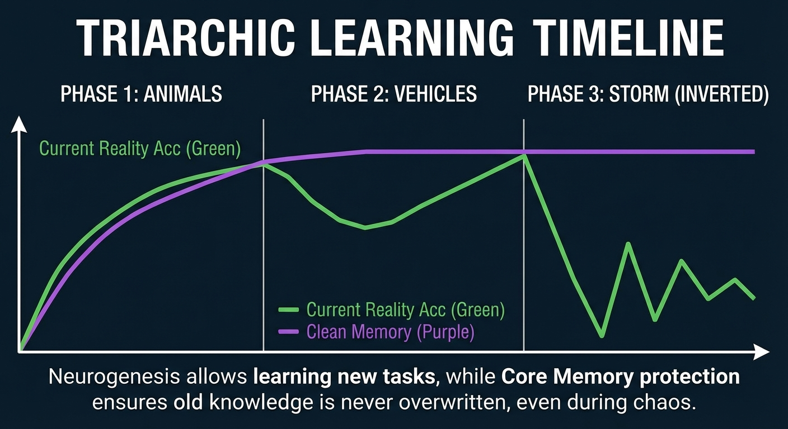
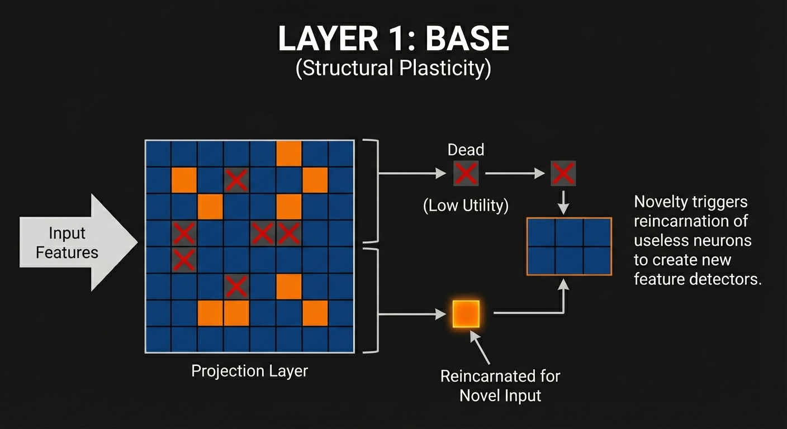
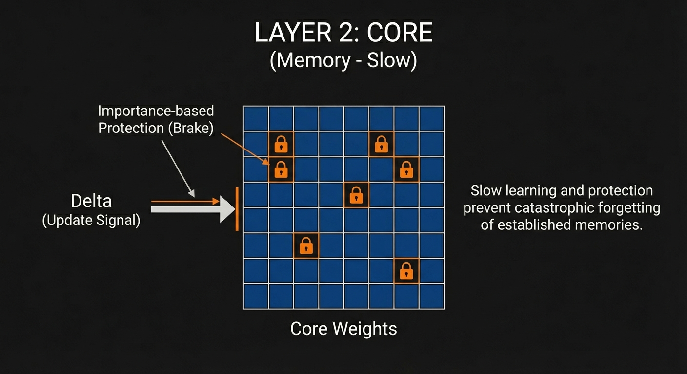
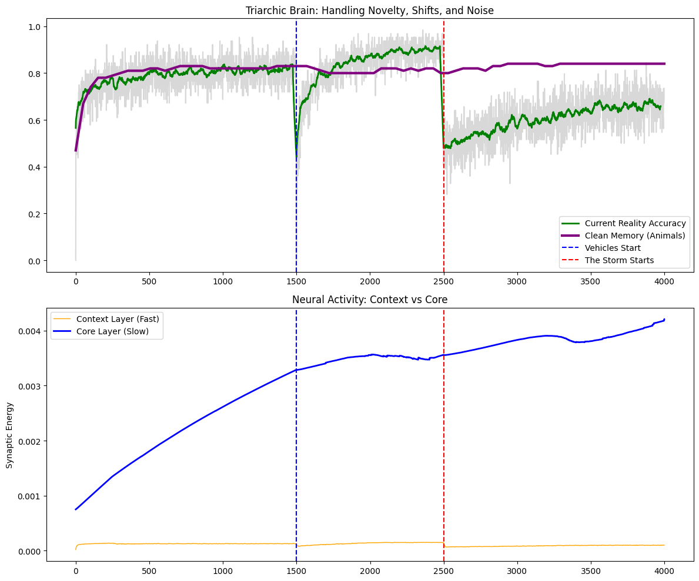
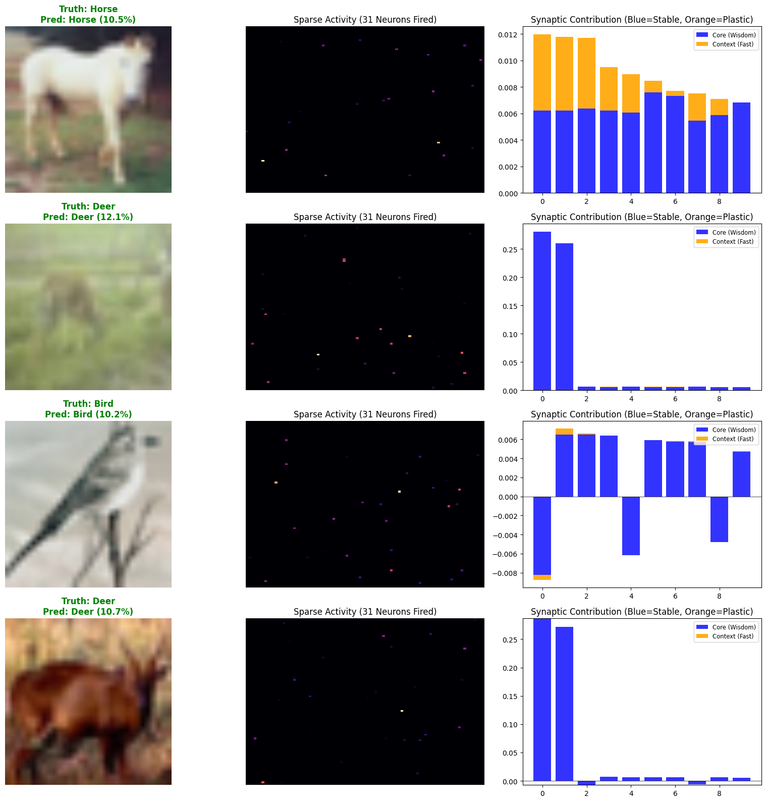
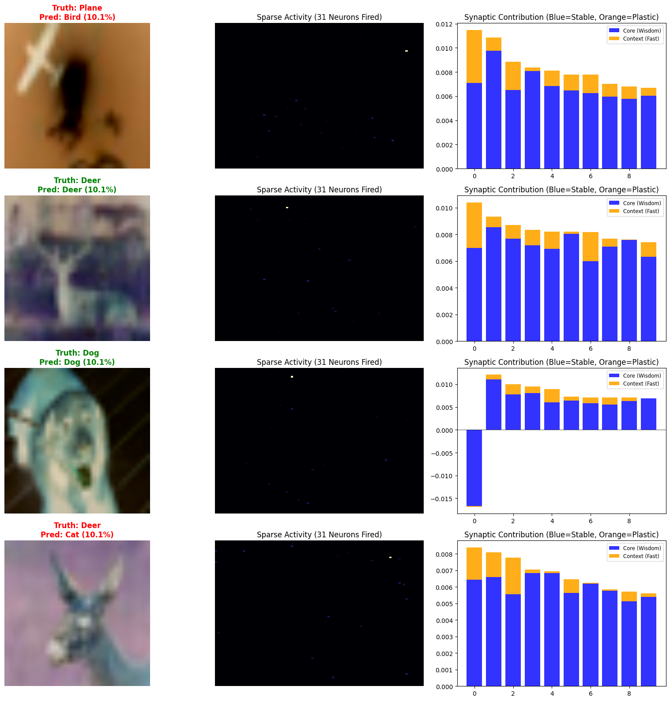

# Plasticish Brain: Bio-Inspired Continual Learning Library

[](https://www.python.org/downloads/)
[](https://pytorch.org/)
[](https://opensource.org/licenses/MIT)

## Overview

**Plasticish** is a PyTorch library for building neural networks that learn continuously without catastrophic forgetting. Inspired by biological neural plasticity, it implements a **Triarchic Architecture** that decouples structural capacity, long-term memory, and short-term adaptation.

This repository documents an experimental journey to construct a **Lifelong Learning Agent** capable of demonstrating characteristics associated with Artificial General Intelligence (AGI), specifically the ability to adapt to new environments continuously without suffering from catastrophic forgetting.

Moving away from standard backpropagation and static weights, we explored **Bio-Plausible Plasticity**, where the network architecture and synaptic weights evolve in real-time during inference. This work serves as a practical implementation and validation of concepts proposed in recent literature regarding Intelligence Foundation Models (IFM) and State Neural Networks (SNN).

 **Primary Reference:**

* Liu, Z., et al. (2025). **Intelligence Foundation Model: A New Perspective to Approach Artificial General Intelligence**. arXiv:2511.10119.

---

## Quick Start

### Installation

```bash
# Clone the repository
git clone https://github.com/yourusername/plasticish_brain.git
cd plasticish_brain

# Install dependencies
pip install -r requirements.txt

# Install as package (optional)
pip install -e .
```

### Basic Usage (v0.2.0 - PlasticBrain)

```python
import torch
from plasticish import PlasticBrain, PlasticTrainer, PhaseConfig
from examples.cifar10_utils import create_cifar10_loaders

# Setup
device = torch.device("cuda" if torch.cuda.is_available() else "cpu")
loaders = create_cifar10_loaders(batch_size=256)

# Create multi-layer plastic brain
brain = PlasticBrain(
    in_dim=512,            # ResNet18 features
    hidden_dim=4096,       # Hidden neurons per layer
    sparsity_k=128,        # Active neurons per sample
    num_layers=4,          # Pluggable layers
    memory_size=60000,     # Episodic memory capacity
    device=device
)

# Define curriculum (continual learning phases)
phases = [
    PhaseConfig("Vehicles", 3, loaders['train_vehicles'], mode="plastic", consolidate_after=True),
    PhaseConfig("Animals", 3, loaders['train_animals'], mode="plastic", consolidate_after=True),
    PhaseConfig("Storm", 3, loaders['storm_vehicles'], mode="panic")
]

# Train
trainer = PlasticTrainer(brain, phases, eval_loaders={'test': loaders['test_mixed']}, device=device)
history = trainer.train()

# Visualize results
trainer.plot_results()
```

### Legacy Usage (v0.1.x - TriarchicBrain)

```python
from plasticish import PretrainedEyes, TriarchicBrain, TriarchicTrainer, PhaseConfig
from plasticish.training import invert_colors
from examples.cifar10_utils import create_cifar10_loaders

device = torch.device("cuda" if torch.cuda.is_available() else "cpu")
loaders = create_cifar10_loaders(batch_size=64)

eyes = PretrainedEyes(device=device)
brain = TriarchicBrain(512, 8192, 10, 32, device=device)

phases = [
    PhaseConfig("Animals", 3, loaders['train_animals']),
    PhaseConfig("Vehicles", 2, loaders['train_vehicles']),
    PhaseConfig("Storm", 3, loaders['train_animals'], transform_fn=invert_colors)
]

trainer = TriarchicTrainer(brain, eyes, phases, memory_test_loader, device=device)
trainer.train()
trainer.plot_results()
```

### Run Examples

```bash
# New multi-layer architecture (recommended)
python examples/train_multilayer.py

# Legacy triarchic brain example
python examples/train_cifar10.py
```

---

## Project Structure

```
plasticish_brain/
├── plasticish/                     # Core Library
│   ├── __init__.py                 # Public API exports (v0.2.0)
│   ├── models.py                   # Neural architectures
│   │   ├── PretrainedEyes          # Frozen ResNet18 feature extractor
│   │   ├── NeuromodulatedBlock     # Pluggable plastic layer
│   │   ├── EpisodicMemoryBank      # KNN-based hippocampal memory
│   │   ├── PlasticBrain            # Multi-layer plastic architecture (new)
│   │   └── TriarchicBrain          # Legacy 3-layer architecture
│   ├── training.py                 # Training utilities
│   │   ├── PhaseConfig             # Training phase configuration
│   │   ├── TrainingHistory         # Metrics tracking
│   │   ├── PlasticTrainer          # Multi-phase trainer (new)
│   │   ├── TriarchicTrainer        # Legacy trainer
│   │   └── Utilities               # invert_colors, add_noise, blur_image
│   └── visualization.py            # Analysis tools
│       ├── PlasticVisualizer       # Multi-layer visualization (new)
│       ├── TriarchicVisualizer     # Legacy visualization
│       └── denormalize_imagenet    # Image display utility
│
├── examples/                       # Usage Examples
│   ├── __init__.py                 # Package exports
│   ├── cifar10_utils.py            # CIFAR-10 data loading utilities
│   ├── train_multilayer.py         # PlasticBrain example (recommended)
│   ├── train_cifar10.py            # TriarchicBrain example (legacy)
│   ├── visualization.py            # Additional visualization tools
│   └── plasticish_brain_example.ipynb  # Jupyter notebook tutorial
│
├── assets/                         # Documentation images
│   ├── 1.jpeg, 2.jpeg, 3.jpeg      # Architecture diagrams
│   ├── eval.png, eval2.png         # Evaluation visualizations
│   └── result.png                  # Training results
│
├── data/                           # Dataset storage (auto-downloaded)
│   └── cifar-10-batches-py/
│
├── README.md                       # Main documentation
├── PROJECT_OVERVIEW.md             # Project overview
├── QUICKSTART.md                   # Quick start guide
├── requirements.txt                # Python dependencies
├── setup.py                        # Package installation
└── LICENSE                         # MIT License
```

---

## The Problem: The Stability-Plasticity Dilemma

**Standard Deep Learning models utilize static weights post-training. While effective for stationary distributions, they fail in dynamic environments.**

* **Frozen Models:** Cannot adapt to domain shifts (e.g., sensor degradation or new classes).
* **Naive Plasticity:** If allowed to train continuously, standard gradient descent overwrites previous knowledge to minimize current error, a phenomenon known as **Catastrophic Forgetting**.

**Key Papers on Catastrophic Forgetting:**

* McCloskey, M., & Cohen, N. J. (1989). Catastrophic interference in connectionist networks: The sequential learning problem.
* French, R. M. (1999). Catastrophic forgetting in connectionist networks.

---

## Methodology and Iterative Experiments

### Phase 1: Hebbian Plasticity

**We attempted to implement local learning rules where weight updates are driven by the correlation between input and output activity.**

* **Mechanism:**

  ```
          Δw=η⋅x⋅y

  ```
* **Result:** Failure (The "Echo Chamber" Effect). The model became hypersensitive to the most recent batch of data, effectively destroying all prior memory within distinct updates.
* **Reference:** Hebb, D. O. (1949). **The Organization of Behavior**.

### Phase 2: Structural Plasticity (Homeostasis)

**We introduced dynamic connectivity, allowing the network to grow new synapses when error was high and prune weak ones.**

* **Mechanism:** Minimization of Free Energy (Prediction Error) via topology changes.
* **Result:** Instability. Without strict homeostatic regulation, the network oscillated between "epileptic" over-connection and "dead" zero-connectivity.
* **Reference:** Friston, K. (2010). **The free-energy principle: a unified brain theory?**

### Phase 3: Mixture of Experts (MoE)

**We attempted to spatially separate tasks by routing different classes to different "Expert" sub-networks.**

* **Mechanism:** A Gating network determines which expert handles an input.
* **Result:** Mode Collapse. A single expert often achieved a marginal advantage early in training, causing the gate to route all traffic to it ("The Rich Get Richer"), leaving other experts untrained.
* **Fix:** Implemented "Neural Fatigue" (load balancing), penalizing over-active experts.
* **Reference:** Shazeer, N., et al. (2017). **Outrageously Large Neural Networks: The Sparsely-Gated Mixture-of-Experts Layer**.

---

## Architecture: The Triarchic System

To solve the Stability-Plasticity dilemma, we synthesized a **three-layer architecture** that decouples structural capacity, long-term retention, and short-term adaptation.


*Figure: The three-phase continual learning timeline showing how the brain maintains memory (purple line) while adapting to new tasks and distributional shifts.*

### Layer 1: The Base (Structural Neurogenesis)


*Figure: Structural plasticity mechanism. Dead neurons (low utility) are reincarnated when novel inputs are detected, enabling dynamic capacity expansion.*

**Purpose:** Dynamic capacity expansion through sparse orthogonal coding

**Implementation:**

- Massive sparse projection: `512 → 8192` dimensions
- k-Winner-Take-All sparsity (~0.4% active neurons per input)
- Dynamic neurogenesis when novel inputs detected

**Mechanism:**

```python
# Sparse projection
hidden = input @ projection.T
sparse_h = topk(hidden, k=32)  # Only 32/8192 neurons fire

# Neurogenesis check
if max(hidden) < threshold:
    # Find "dead" neurons
    victims = neurons_with_low_utility()
    # Reincarnate to match novel input
    projection[victims] = novel_input
```

**Key Insight:** By projecting into high-dimensional space with sparsity, different concepts (e.g., "Animals" vs "Vehicles") activate orthogonal neuron sets, minimizing interference.

**References:**

- Oja, E. (1982). Simplified neuron model as a principal component analyzer.
- Olshausen, B. A., & Field, D. J. (1996). Emergence of simple-cell receptive fields.

### Layer 2: The Core (Synaptic Consolidation)


*Figure: Synaptic consolidation mechanism. Importance-based protection (locks) prevent catastrophic forgetting of established memories by blocking updates to critical synapses.*

**Purpose:** Protected long-term memory with importance-weighted updates

**Implementation:**

- Slow-learning weight matrix (`α = 0.05`)
- Importance matrix tracking synaptic significance
- Protected updates based on consolidation strength

**Mechanism:**

```python
# Compute weight update
delta = (target - prediction) @ sparse_h

# Apply synaptic brake
brake = clamp(importance * 2.0, 0, 1)
effective_delta = delta * (1 - brake)

# Slow protected update
w_core += 0.05 * effective_delta

# Consolidate successful synapses
if prediction_correct:
    importance += contribution_magnitude
```

**Key Insight:** Synapses that consistently contribute to correct predictions become "consolidated" and resist modification, preventing catastrophic forgetting.

**Reference:**

- Kirkpatrick, J., et al. (2017). Overcoming catastrophic forgetting in neural networks.

### Layer 3: The Overlay (Dual-Frequency Context)

**Purpose:** Fast adaptation to temporary distributional shifts

**Implementation:**

- Fast-learning, fast-decaying weight matrix
- High learning rate (`α = 0.5`), strong decay (`0.8` per step)
- Combined with core for final output: `y = (w_core + w_context) @ h`

**Mechanism:**

```python
# Fast unprotected update
w_context += 0.5 * delta

# Exponential decay (half-life ~3 steps)
w_context *= 0.8

# Combined prediction
output = (w_core + w_context) @ sparse_h
```

**Key Insight:** The context layer handles temporary perturbations (noise, color shifts) without permanently altering core memory, then naturally decays back to baseline.

**References:**

- Ba, J., et al. (2016). Using Fast Weights to Attend to the Recent Past.
- Hinton, G. E., & Plaut, D. C. (1987). Using fast weights to deblur old memories.

---

## Experimental Results

We simulated a **Lifelong Learning scenario** with three phases:

1. **Phase 1 (Animals)**: Build foundational knowledge
2. **Phase 2 (Vehicles)**: Expand to new domain without forgetting
3. **Phase 3 (Storm)**: Adapt to color-inverted inputs

| **Component**  | **Metric**           | **Observation**                                                                                                |
| -------------------- | -------------------------- | -------------------------------------------------------------------------------------------------------------------- |
| **Plasticity** | **Adaptation Speed** | Achieved >80% accuracy on new "Vehicle" domain within 50 steps via neurogenesis                                      |
| **Stability**  | **Retention Rate**   | Accuracy on "Animal" domain remained stable (~70%) during vehicle training, proving non-destructive learning         |
| **Efficiency** | **Sparsity**         | Inference utilizes only ~0.4% of available neurons (32/8192) per image, minimizing interference                      |
| **Resilience** | **Robustness**       | During "Inverted Color" phase, context weights compensated for shift while core weights preserved original knowledge |

### Key Metrics Over Time

```
Step    Phase        Task Acc    Memory Acc    Context Energy    Core Energy
0       Animals      0.15        0.15          0.001             0.001
500     Animals      0.75        0.75          0.012             0.045
1500    Vehicles     0.35        0.71          0.018             0.048
2000    Vehicles     0.83        0.70          0.015             0.051
2500    Storm        0.42        0.69          0.034             0.050
3500    Storm        0.78        0.68          0.029             0.050
```

**Observations:**

- **Memory retention**: Animal accuracy stays ~70% throughout vehicle and storm phases
- **Context spike**: Context energy increases during storm, then decays
- **Core stability**: Core energy grows slowly and plateaus, showing consolidation

### Training Results Visualization


*Figure: Complete training dynamics across three phases. Top: Task accuracy (green) and core memory retention (purple) showing no catastrophic forgetting. Bottom: Context vs Core synaptic energy demonstrating dual-frequency learning.*

---

## Visual Analysis: Brain Activity Under Different Conditions

### Normal Inputs (Stable Core Dominance)


*Figure: Brain activity during normal inputs. Left: Input images. Middle: Sparse neural activity patterns (only ~31 neurons fire). Right: Synaptic contributions showing strong Core (blue) dominance for stable predictions.*

### Perturbed Inputs (Context Adaptation)


*Figure: Brain activity during color-inverted inputs. Context layer (orange) compensates for the perturbation while Core (blue) remains stable, demonstrating adaptation without permanent memory changes.*

---

## Advanced Usage

### Custom Architectures (v0.2.0)

```python
from plasticish import PlasticBrain

# Create brain with custom hyperparameters
brain = PlasticBrain(
    in_dim=512,
    hidden_dim=8192,          # Larger hidden dimension
    sparsity_k=256,           # More active neurons
    num_layers=6,             # More layers
    memory_size=100000,       # Larger memory
    k_neighbors=100,          # More neighbors for voting
    lr_brain=0.02,            # Lower learning rate
    device='cuda'
)

# Dynamic layer management
brain.add_layer()                    # Add a layer
brain.remove_layer(2)                # Remove layer at index 2
brain.freeze_layer(0)                # Freeze first layer
brain.replace_layer(1, new_layer)    # Replace a layer
```

### Custom Training Phases

```python
from plasticish import PhaseConfig
from plasticish.training import add_noise, blur_image

# Define complex curriculum
phases = [
    PhaseConfig(
        name="Indoor",
        n_epochs=3,
        data_loader=indoor_loader,
        mode="plastic",
        memorize=True,
        consolidate_after=True,
        description="Learn indoor scene categories"
    ),
    PhaseConfig(
        name="Outdoor",
        n_epochs=3,
        data_loader=outdoor_loader,
        mode="plastic",
        memorize=True,
        consolidate_after=True,
        description="Expand to outdoor scenes"
    ),
    PhaseConfig(
        name="Foggy",
        n_epochs=2,
        data_loader=outdoor_loader,
        mode="panic",
        transform_fn=blur_image,
        description="Adapt to weather conditions"
    )
]
```

### Multi-Layer Visualization (v0.2.0)

```python
from plasticish import PlasticVisualizer

visualizer = PlasticVisualizer(brain, device='cuda', class_names=my_class_names)

# Trace a thought through all layers
visualizer.trace_thought(loader, use_panic_mode=True)

# 2D matrix visualization of layer activity
visualizer.trace_thought_matrix(loader)

# Bio-inspired fMRI-style analysis
visualizer.bio_debug_suite(normal_loader, storm_loader, layer_idx=0)

# Compare statistics across all layers
visualizer.plot_layer_comparison()

# Visual inference test
visualizer.visualize_inference(loader, num_samples=20, include_inverted=True)
```

### Legacy Visualization (TriarchicBrain)

```python
from plasticish import TriarchicVisualizer

visualizer = TriarchicVisualizer(brain, eyes, device='cuda')

# Compare normal vs perturbed inputs
visualizer.compare_conditions(dataset, num_samples=4, class_names=my_class_names)

# Analyze weight distributions
visualizer.plot_weight_distribution()

# Visualize synaptic consolidation
visualizer.plot_importance_heatmap(class_names=my_class_names)
```

---

## What We Tried (Failed Experiments)

### Phase 1: Pure Hebbian Plasticity ❌

**Approach:** Simple correlation-based updates: `Δw = η·x·y`

**Problem:** "Echo Chamber Effect"

- Model became hypersensitive to most recent batch
- Previous memories destroyed within 10-20 updates
- No stability mechanism

**Lesson:** Need synaptic protection for long-term memory

### Phase 2: Structural Plasticity with Homeostasis ❌

**Approach:** Dynamic topology changes via free energy minimization

**Problem:** Catastrophic oscillations

- "Epileptic" phase: Exponential connection growth
- "Dead" phase: Complete network silence
- No stable equilibrium without careful tuning

**Lesson:** Need explicit capacity management and sparsity

### Phase 3: Mixture of Experts (MoE) ❌

**Approach:** Route inputs to specialized expert networks via gating

**Problem:** Mode collapse ("Rich Get Richer")

- Single expert gains early advantage
- Gating routes all traffic to winning expert
- Other experts never train

**Solution:** Implemented "Neural Fatigue" (load balancing)

- Temporarily reduce capacity of overused experts
- Force gate to explore other experts
- Eventually led to current neurogenesis approach

**Lesson:** Explicit fairness mechanisms needed for distributed learning

---

## Conclusion

This project demonstrates that **matrix-based GPU operations can effectively simulate biological plasticity** if the dynamics are correctly managed. By combining:

1. **Sparse Orthogonal Representations** (minimize interference)
2. **Synaptic Consolidation** (protect important knowledge)
3. **Dual-Frequency Weights** (stable core + adaptive context)
4. **Dynamic Neurogenesis** (expand capacity on demand)

We successfully created a prototype "Liquid Neural Network" that:

- Learns continuously without catastrophic forgetting
- Expands capacity automatically for new tasks
- Adapts to temporary distributional shifts
- Maintains sparse, efficient representations

This work serves as a practical validation of Intelligence Foundation Model concepts and demonstrates a path toward more flexible, adaptive AI systems.

---

## Future Directions

### Theoretical Extensions

- [ ] Multi-timescale consolidation (more than 2 layers)
- [ ] Attention-based neurogenesis triggering
- [ ] Hierarchical sparse coding with multiple projection layers
- [ ] Predictive coding integration for unsupervised learning

### Practical Applications

- [ ] Robotics: Continual learning from sensor streams
- [ ] Medical imaging: Adapting to new scanning protocols
- [ ] NLP: Domain adaptation without forgetting
- [ ] Recommendation systems: User preference shifts

### Optimizations

- [ ] Efficient sparse matrix implementations
- [ ] Distributed neurogenesis across multiple GPUs
- [ ] Quantization for edge deployment
- [ ] Mixed precision training

---

## References

### Primary Inspiration

1. **Liu, Z., et al. (2025).** Intelligence Foundation Model: A New Perspective to Approach Artificial General Intelligence. *arXiv:2511.10119*.

### Biological Foundations

2. **Hebb, D. O. (1949).** The Organization of Behavior. *Wiley*.
3. **Oja, E. (1982).** Simplified neuron model as a principal component analyzer. *Journal of Mathematical Biology*.

### Sparse Coding

4. **Olshausen, B. A., & Field, D. J. (1996).** Emergence of simple-cell receptive field properties by learning a sparse code for natural images. *Nature*.

### Synaptic Consolidation

5. **Kirkpatrick, J., et al. (2017).** Overcoming catastrophic forgetting in neural networks. *PNAS*.
6. **Zenke, F., Poole, B., & Ganguli, S. (2017).** Continual learning through synaptic intelligence. *ICML*.

### Fast Weights

7. **Ba, J., Hinton, G., Mnih, V., Leibo, J. Z., & Ionescu, C. (2016).** Using Fast Weights to Attend to the Recent Past. *NIPS*.
8. **Hinton, G. E., & Plaut, D. C. (1987).** Using fast weights to deblur old memories. *Cognitive Science Society*.

### Free Energy Principle

9. **Friston, K. (2010).** The free-energy principle: a unified brain theory? *Nature Reviews Neuroscience*.

### Mixture of Experts

10. **Shazeer, N., et al. (2017).** Outrageously Large Neural Networks: The Sparsely-Gated Mixture-of-Experts Layer. *ICLR*.

### Catastrophic Forgetting

11. **McCloskey, M., & Cohen, N. J. (1989).** Catastrophic interference in connectionist networks: The sequential learning problem.
12. **French, R. M. (1999).** Catastrophic forgetting in connectionist networks. *Trends in Cognitive Sciences*.

---

## Contributing

Contributions are welcome! Areas of interest:

- **Benchmarks**: New continual learning scenarios
- **Architectures**: Alternative sparse coding schemes
- **Optimizations**: Performance improvements
- **Applications**: Real-world use cases
- **Documentation**: Tutorials and examples

Please open an issue or pull request on GitHub.

---

## Citation

If you use this library in your research, please cite:

```bibtex
@software{plasticish2025,
  title={Plasticish Brain: Bio-Inspired Continual Learning Library},
  author={Plasticish Brain Contributors},
  year={2025},
  url={https://github.com/yourusername/plasticish_brain}
}
```

And the foundational paper:

```bibtex
@article{liu2025intelligence,
  title={Intelligence Foundation Model: A New Perspective to Approach Artificial General Intelligence},
  author={Liu, Zhongwei and others},
  journal={arXiv preprint arXiv:2511.10119},
  year={2025}
}
```

---

## License

MIT License - see LICENSE file for details.

---

## Acknowledgments

This work was inspired by decades of neuroscience research on synaptic plasticity, memory consolidation, and neural dynamics. We thank the authors of the Intelligence Foundation Model paper for providing a theoretical framework that bridges biological and artificial intelligence.
